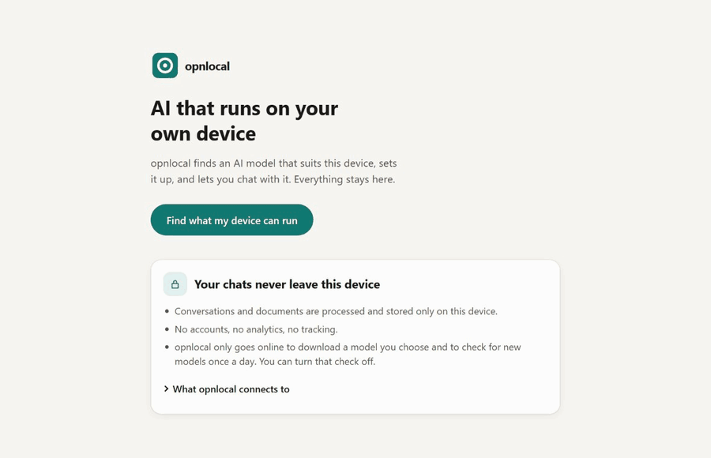

# opnlocal

**Private AI on your own device, for people who have never heard of VRAM or quantization.**
opnlocal checks what your computer or phone can handle, picks a model that fits, downloads
it, measures how fast it really runs, and lets you chat. Your chats never leave the device.

*The real app on a Windows PC with a fresh install. The 5.7 GB download and the speed test are sped
up 30×; everything else is real time.*

## Download

Get the latest version from **[GitHub Releases](https://github.com/MilanDanilovic/opnlocal/releases/latest)**:

| Platform | Download | Notes |
|---|---|---|
| Windows 10/11 (x64) | `.exe` installer | No admin rights needed. Not code-signed yet: Windows SmartScreen will warn → *More info* → *Run anyway*. |
| macOS 13+ (Apple Silicon) | `.dmg` | Not signed or notarized yet: right-click the app → *Open* the first time. |
| Linux x64 | `.deb` or `.AppImage` | `.deb` for Ubuntu 22.04 or newer and similar. The AppImage runs on most distributions without installing: make it executable and open it. |
| Android 9+ (64-bit) | `.apk` | Install from file (allow "unknown sources"). Needs a phone from about 2019 or newer. |
| iOS 17+ | `.ipa` (unsigned) | Sideloading only (e.g. Sideloadly with your own Apple ID, see [docs/RELEASING.md](docs/RELEASING.md)). No App Store build yet. |

## How it works

1. **Find what my device can run.** It checks memory, graphics, processor and free space.
2. **What would you like to do?** Everyday help, coding, writing, or private documents.
3. **Up to three picks, in plain words:** *Recommended*, *Lighter & faster*, *Stronger, but
   tight*.
4. **Download** with progress, cancel, and resume after a dropped connection. Every file is
   checked against a signed list before it's used.
5. **Measure.** A short test on your device (up to about a minute): "Replies at about 12 words
   per second. Faster than most people read."
6. **Chat.** Saved conversations, formatted answers and code, attach PDF/Word/text files, stop,
   try again, and an optional "Think harder" mode.

## How it differs from LM Studio, Ollama, Jan and GPT4All

Those are great tools, and most of them run on the same engine as opnlocal (llama.cpp). They
suit people who already know what they want: you browse models and choose a size and a
quantization. opnlocal is for people who don't want to make those choices.

- **It picks for you.** You say what you want to do; it suggests up to three models that fit
  your device, in plain words. You only see technical details if you open Advanced.
- **It measures instead of guessing.** Before a model runs, it only says whether the model
  fits. After download it measures the real speed on your device and tells you what that means.
- **It runs on phones too,** with the model on the phone itself. As of September 2026, Ollama,
  Jan and GPT4All run on computers only, and LM Studio's iPhone app (Locally) uses models
  running on your computer.
- **It's open source** (Apache-2.0), like Ollama, Jan and GPT4All. The LM Studio app isn't.

The trade-off: a small list of 9 tested models instead of all of Hugging Face. You can still
import your own `.gguf` file in Settings → Advanced.

## Privacy

Apart from links you tap, opnlocal connects to the internet for exactly two things: model
downloads you start (huggingface.co), and a signed model list checked at most once a day
(github.com; you can turn it off). No accounts, analytics, crash reports or telemetry. There is
no local server and no open port. Details: [docs/PRIVACY.md](docs/PRIVACY.md).

## What's been tested (v0.1.0)

Honest status. Help testing on real phones and Macs is very welcome.

| Platform | Tested for real | Not tested yet |
|---|---|---|
| Windows | Installed build, whole journey (download, speed test, chat) on an AMD RX 7800 XT | NVIDIA and Intel graphics, Windows 10 |
| Android | Android emulator: whole journey | **No physical phone yet** |
| Linux | Automated build machine: installs, detects hardware, generates text | A desktop with a graphics card |
| macOS | Automated build machine (virtual Mac): detects hardware, generates text with Metal | **No real Mac yet** |
| iOS | iPhone simulator: detects hardware, generates text | **No physical iPhone yet** |

All 9 models in the catalog were downloaded, speed-tested and chatted with on the Windows PC:
[catalog/VERIFICATION.md](catalog/VERIFICATION.md).

## For developers

- Architecture and platform decisions: [docs/DECISIONS.md](docs/DECISIONS.md)
- Build for each platform: [docs/BUILDING.md](docs/BUILDING.md) · Tests: [docs/TESTING.md](docs/TESTING.md)
- How the model catalog is signed and how forks use their own: [docs/CATALOG.md](docs/CATALOG.md)
- Contributing: [CONTRIBUTING.md](CONTRIBUTING.md) · Security: [SECURITY.md](SECURITY.md)

The engine is Rust ([`crates/engine`](crates/engine)); the app is Tauri 2 with a Svelte 5 UI
([`app`](app)); models run in-process through llama.cpp on every platform.

## License

[Apache License 2.0](LICENSE). Copyright 2026 Milan Danilovic. Third-party components are listed
in [THIRD_PARTY_NOTICES.txt](THIRD_PARTY_NOTICES.txt), also shown in the app. Models have their
own licenses, shown in the app before download.
